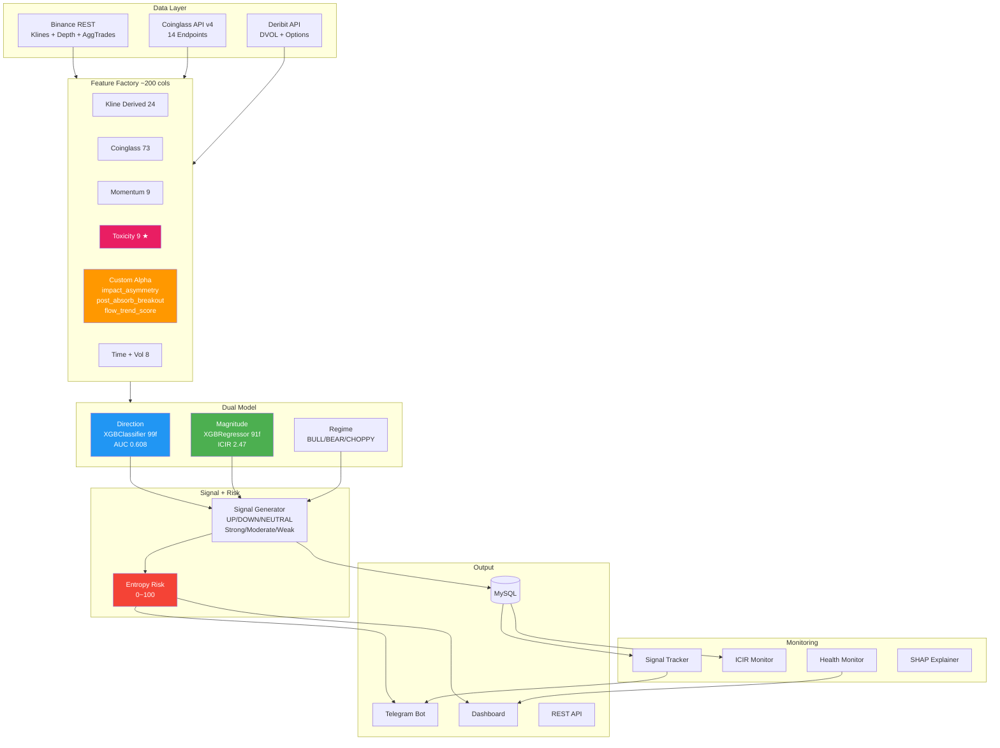

# BTC Market Intelligence Indicator — System Architecture v7

> **Last Updated:** 2026-04-08
> **Author:** rfo
> **Status:** Production (Railway)

## 1. 系統定位

預測未來 4h 的 BTC 方向、強度、信心。**不是交易策略** — 不做 entry/exit、TP/SL、倉位管理。

## 2. 分層架構

```
┌─────────────────────────────────────────────────────────┐
│                    OUTPUT LAYER                          │
│  Telegram Bot (圖表+信號+Risk)  │  Dashboard (Web)      │
│  Interactive Chart (TradingView) │  REST API             │
└────────────────────────┬────────────────────────────────┘
                         │
┌────────────────────────┴────────────────────────────────┐
│                 SIGNAL GENERATION                        │
│  Direction: P(UP) > 0.6 → UP, < 0.4 → DOWN             │
│  Confidence = mag_percentile × dir_conviction           │
│  Strength: Strong ≥ 80, Moderate ≥ 65, Weak < 65       │
│  BBP 確認閘門 + Regime 動態死區 + Hysteresis            │
│  Entropy Risk Score (0~100)                             │
└────────────────────────┬────────────────────────────────┘
                         │
┌────────────────────────┴────────────────────────────────┐
│                    DUAL MODEL                            │
│  ┌──────────────────┐  ┌──────────────────────┐         │
│  │ Direction Model   │  │ Magnitude Model      │         │
│  │ XGBClassifier     │  │ XGBRegressor         │         │
│  │ 99 features       │  │ 91 features          │         │
│  │ Output: P(UP)     │  │ Output: |return_4h|  │         │
│  │ OOS AUC: 0.608    │  │ OOS ICIR: 2.47       │         │
│  └──────────────────┘  └──────────────────────┘         │
│  Regime: CHOPPY / TRENDING_BULL / TRENDING_BEAR         │
└────────────────────────┬────────────────────────────────┘
                         │
┌────────────────────────┴────────────────────────────────┐
│              FEATURE FACTORY (~200 columns)              │
│                                                          │
│  Kline 衍生 (24)     │  Coinglass 原始+Z-score (73)     │
│  Momentum/Slope (9)  │  Vol Dynamics + Time (8)          │
│  Order Flow Toxicity (9) ← tox_pressure_zscore IC+0.071 │
│  Custom Alpha: impact_asymmetry, post_absorb_breakout,  │
│    flow_trend_score, absorption, fragility, squeeze      │
└────────────────────────┬────────────────────────────────┘
                         │
┌────────────────────────┴────────────────────────────────┐
│                   DATA LAYER                             │
│  Binance REST: Klines 1h, Depth L20, AggTrades          │
│  Coinglass v4: 14 endpoints (OI, Funding, Taker, L/S,   │
│    CB Premium, BFX Margin, Futures/Spot CVD, Liq Agg)    │
│  Deribit: DVOL, Options Summary                          │
└─────────────────────────────────────────────────────────┘
```

## 3. 監控體系

| 模組 | 功能 | 頻率 |
|------|------|------|
| HealthMonitor | 數據新鮮度、NaN率、DB健康 | 每小時 |
| MonitorICIR | IC/準確率即時監控、退化警報 | 每小時 |
| SignalTracker | Strong+Moderate 4h結果回填 | 每小時 |
| SignalExplainer | SHAP 驅動因子分析 | Strong 信號時 |
| EntropyAnalyzer | 市場熵、互資訊、預測熵 | 每小時 |
| EntropyRiskManager | 動態風險分數 0~100 | 每小時 |

## 4. 資料流（每小時 :02 分）

```
fetch APIs → build_live_features → NaN Guard → predict
    → signal generation → entropy risk → Telegram + DB
    → backfill_outcomes → monitor → health check
```

## 5. Mermaid 架構圖



## 6. 部署架構（Railway）

| 服務 | 用途 | Dockerfile |
|------|------|-----------|
| rfobot | 主 Bot, Telegram webhook, OKX WS | Dockerfile |
| 輸出圖表 | Indicator engine, 圖表, Dashboard | Dockerfile.indicator |
| market_data | Binance+OKX WS trades, flow bars | Dockerfile.marketdata |
| MySQL 8.0 | 所有持久化數據 | Docker image |

## 7. 儲存

| 位置 | 內容 | 用途 |
|------|------|------|
| MySQL (Railway) | indicator_history, tracked_signals, snapshots | 線上持久化 |
| Parquet (local) | raw_data/*.parquet, indicator_history.parquet | 離線回測+訓練 |
| model_artifacts/ | direction_xgb.json, magnitude_xgb.json | 模型部署 |

## 8. 已研究未採用

| 模組 | 淘汰原因 |
|------|----------|
| ChessDomination 4D (CDP/CUFD/XYZ) | cdp_score IC=0.012，太弱 |
| consolidation_score | IC ≈ 0 |
| 流動性獵取反轉 | 4h IC ≈ 0 |
| K 線 delta 背離 | IC = 0.01 |
